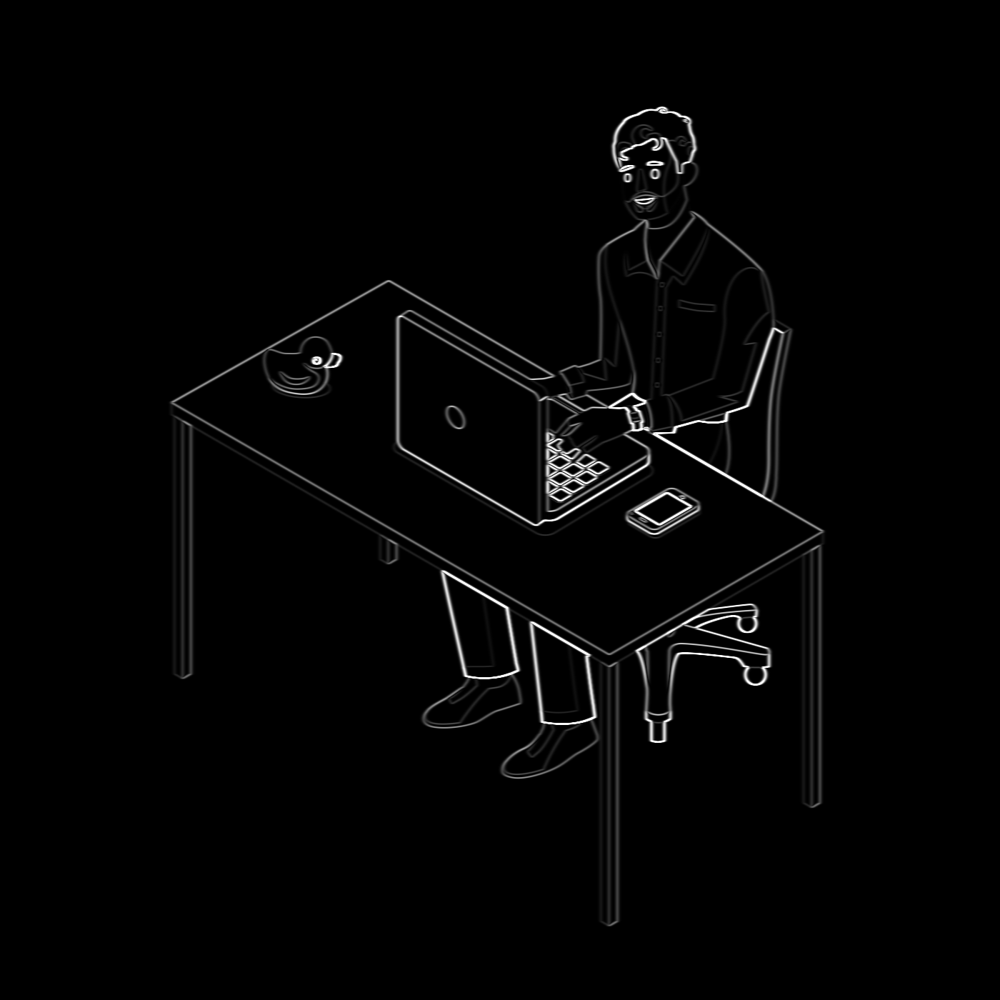
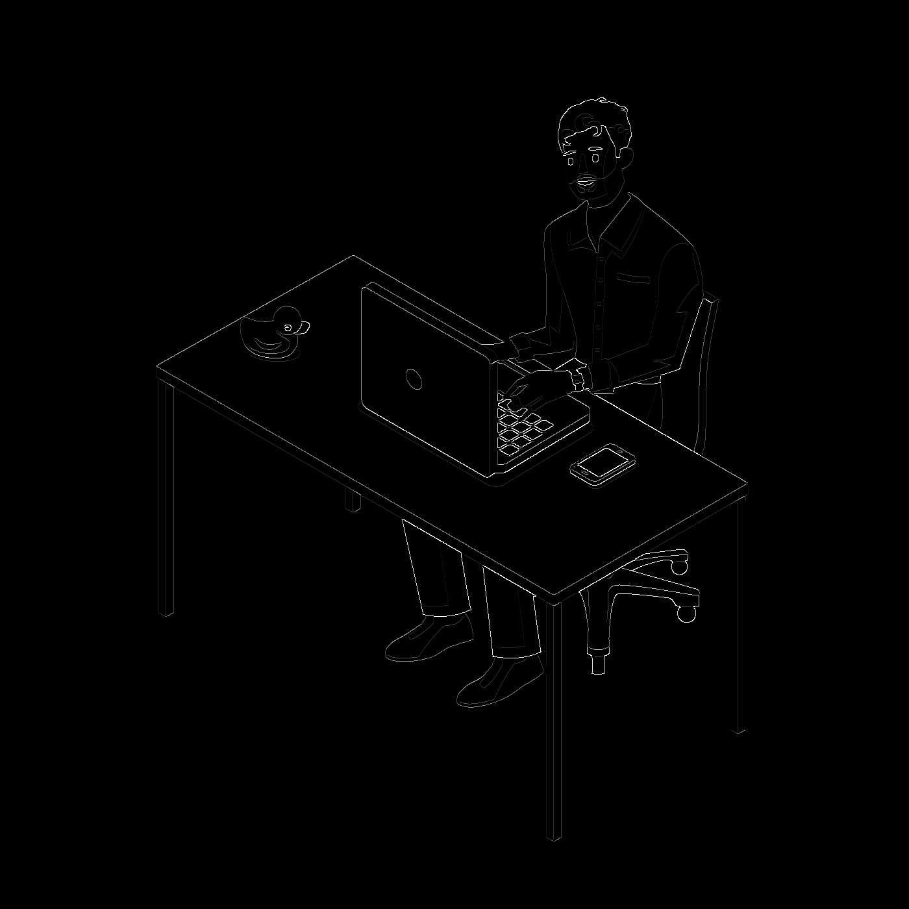

# zcanny

Implementation of the Canny Edge detection algorithm using Zig, for learning purposes.

### Image Pipeline

  
Original Image

  
  
Stage 1: Gaussian Blur

  
  
Stage 2: Gradient Computation with Sobel kernels

  
  
Stage 3: Thinned magnitude with non-max suppression

  

### References
1. [Canny Edge Detection](https://en.wikipedia.org/wiki/Canny_edge_detector)
2. [Zig](https://ziglang.org/)
